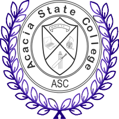

   

## How to use this site

This site describes the first task for Year 9 Economics and Business students of Acacia State College and acts as a guide, task document and criteria document. 

* This site serves a _model_ for presenting content digitally _in a professional way_. You are free to choose your own professional layout and electronic format.

* Use the menu bar at the top to navigate to relevant pages describing aspects of your assignment.

* Use the menu boxes at the left on each page to jump to entries.

* Revisit the different pages as you progress with your task.

* You can always return here by clicking "**Economics and Business[9]**" at the top left of any page.

***

* Use each of the pages to help
    + (This page) **Economics & Business[9]**: Why you are doing this 
    + **Overview**: Broad requirements
    + **The Task**: Specific requirements, details and steps to completing the task
    + **The Criteria**: How you will be assessed
    + **Source**: The background information
    + **Resources**: Information you will need
    + **Methods**: Guidance on using the resources
    
***

## What the task assesses

In completing this task, you are showing evidence of having achieved the [Year 9 Economics and Business Achievement Standard](https://www.australiancurriculum.edu.au/f-10-curriculum/humanities-and-social-sciences/economics-and-business/?year=12559&strand=Economics+and+Business+Knowledge+and+Understanding&strand=Economics+and+Business+Skills&capability=ignore&capability=Literacy&capability=Numeracy&capability=Information+and+Communication+Technology+%28ICT%29+Capability&capability=Critical+and+Creative+Thinking&capability=Personal+and+Social+Capability&capability=Ethical+Understanding&capability=Intercultural+Understanding&priority=ignore&priority=Aboriginal+and+Torres+Strait+Islander+Histories+and+Cultures&priority=Asia+and+Australia%E2%80%99s+Engagement+with+Asia&priority=Sustainability&elaborations=true&elaborations=false&scotterms=false&isFirstPageLoad=false) 

Pay attention to these aspects of the Achievement Standard:

* "[Students] explain the importance of managing financial risks and rewards and analyse the different strategies that may be used"

* "When researching, students develop questions and simple hypotheses to frame an investigation of an economic or business issue"

* "[Students] gather and analyse relevant data and information from different sources to answer questions, identify trends and explain relationships" 

* "Students generate alternative responses to an issue and use cost-benefit analysis and appropriate criteria to propose a course of action"

(Australian Curriculum, Assessment and Reporting Authority [ACARA], n.d.-a)

In completing this task, you will draw on your skills from the [General Capabilities](https://www.australiancurriculum.edu.au/f-10-curriculum/general-capabilities). This site will guide you to pay attention to [Literacy](https://www.australiancurriculum.edu.au/f-10-curriculum/general-capabilities/literacy/), [Numeracy](https://www.australiancurriculum.edu.au/f-10-curriculum/general-capabilities/numeracy/) and [Information and Communitication (ICT)](https://www.australiancurriculum.edu.au/f-10-curriculum/general-capabilities/information-and-communication-technology-ict-capability/) capabilities where needed (ACARA, n.d. -b).

## Why there so much guidance

It may look like much of the task is in the form of simply following instructions, but these are just steps to guide you to the real task of thinking.

As students, you will develop stronger skills in critically thinking about issues if your reading is carefully guided (Healy, 2008, p.23). This will also help you appreciate the "design components" of the various sources and presentation piece (Healy, 2008, p.27). Directing you to "important features" "complements" your learning as you engage with the task (Tan, 2008, p.156).

## Help

If you need help, go to the [FAQ - Contact](contact.html) page. Any questions sent by email will be added to the FAQ as anonymous question and answer.

***
