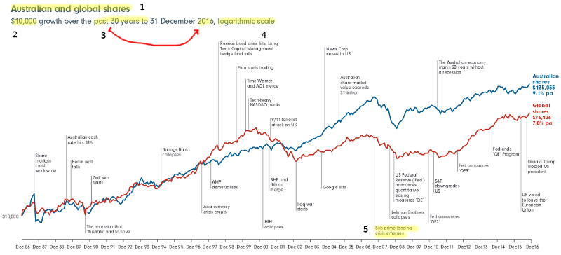

   

This page contains advice and explanations to help you engage with the resources.

# Who provides it?

Determine who is providing the information. Some linked sites are provided or regulated by the Government of the Commonwealth of Australia. Their purpose is to provide information to help Australian citizens (see [link](https://www.moneysmart.gov.au/about-us#Who) MoneySmart, n.d.). Other links in following sections are from businesses, also providing factual information but at the same time hoping to influence consumers to use their services. It is necessary to understand this "background" to evaluate the "nature of information" (Hagel, Lingham, Owen & Tyson, n.d., p.2).

# Writing

In creating written communication you need to consider what you want to communicate, your relationship with the reader and how to organise and present your writing. These are expressed in terms of field, tenor and mode (Kalantzis, Cope, Chan, & Dalley-Trim, 2016,  p.156).  

Aspect of text | Description
---------------|----------------------------
Field          | subject matter or content - what it is about
Tenor          | realtionship between writer and reader - how familiar, differences in status 
Mode           | the role of the language - is it like spoken language, serious, formal

As you read through the resource materials, consider these aspects.

# Creating your presentation

The Office software you use can export to multiple formats including html for webpages. You can work using a variety of tools and combining the various output into PowerPoint or Word for example.  

# Percentage Change

Percentage change is used to show a proportion of change in a value. Referring to an *old* and *new* value, the amount something has changed is the difference.  $new - old = difference$  

This can be negative or positive. Usually you will use the positive number with the terms *increase* or *decrease*.

The proportional change is the change expressed as a fraction of the old value. $\frac{difference}{old}$  

Percentage means the same as divided by 100. $37.5\% = \frac{37.5}{100}$  

This is why we multiply by 100 when calculating percentages, *because:* $\frac{37.5}{100} = 0.375 = 37.5\%$  

In one expression, percentage change is $percentage \ change = \frac{new - old}{old} \times 100\%$

(MathsIsFun, n.d.)

# Investment Types

A Summary is provided to help understand the benefits and risk for different types of investment.

*Savings account* 

* You earn income from interest 
* You can access your money anytime with a debit card 
* There's virtually no risk of losing your money 
* Very safe — deposits < $250 000 guaranteed by the government 
* Interest rates change regularly so income not consistent 
* Interest earned from savings is taxable 
* Account-keeping and transaction fees are often charged 

*Fixed term deposit* 

* Can calculate exactly what your return will be as the interest rate does not change for the term of investment 
* Rates of return are often slightly higher than a regular savings account 
* There's virtually no risk of losing your money 
* Very safe — deposits < $250 000 guaranteed by the Government 
* Penalties are incurred if you wish to access your money before the term deposit matures 
* Less flexible than regular online savings accounts 
* Honeymoon rates can drop if the investment automatically rolls over to a new term at maturity 

*Property investment* 

* You are investing in a tangible asset 
* Property can be less price volatile than shares or other investments 
* Potential to make a capital gain from growth in the value of the property 
* Potential to earn a regular income from rent 
* Tax benefits through negative gearing 
* There are very high entry and exit costs (legal fees, stamp duty, agent commissions, etc.) 
* Rental income often won’t cover your mortgage payments or other expenses 
* A jump in interest rates will decrease your returns 
* You may have to cover maintenance costs and periods of time without a tenant 
* Takes many months to sell property assets so you won’t be able to access investment quickly 
* Run risk of negative equity where the property market declined and investors owe more than the market value of the property 

*Share funds* 

* Potential capital gains from owning an asset that increases in value over time 
* Potential income from dividends 
* Lower tax rates on long-term capital gains 
* Can sell and liquefy assets within a few days 
* Prices highly volatile 
* Dividends may vary 
* If company goes bankrupt, money could be lost 
* Small brokerage fees paid for transactions 

_Summarised from_ (ASIC, n.d.-a).

# Rates of return

Generally, the lower the risk, the lower the return. (see [MoneySmart](https://www.moneysmart.gov.au/investing/invest-smarter/risk-and-return) (ASIC, n.d.-a)

In determining strategies, you may consider different amounts of risk and return but this will need to be clearly stated in your *advice statement* (Stage 5).

# Charts

 Adapted from 30 Years in Australian and Global Shares (FIL Responsible Entity, 2017)

### 1 Title

This compares the indices (essentially average performance) for shares in Australian companies with shares all around the world.

### 2-3 Amount and time  

The growth of an investment of $10 000 from 31 December 1986 until 31 December 2016 is shown. 

### 4 Logarithmic Scale

The logarithm is a concept you may see in year 10. To understand this chart you need to know that for a linear scale 10, 20, 30, 40 are the same distance apart (plus 10 is the same distance) 

For a logarithmic scale 10, 100, 1 000, 10 000 will be the same distance apart (times 10 gives the same distance). 

 (image ASCTT, 2017).
If A shows growth on a linearly scaled y-axis, changing to a logarithmically scaled y-axis will create something looking more like B. 

A 5% change in _$100_ is _$5_, while a 5% change in _$10 000_ is _$500_. Changes in amount become bigger, hence this indicates relative changes. 

### 5 Events

Events are shown on the timeline. Some are causes for changes in share value while others are responses to market conditions which are also relfected in share value. Note the Subprime lending crisis which contributed to the Global Financial Crisis (GFC) (ASIC, n.d.).

